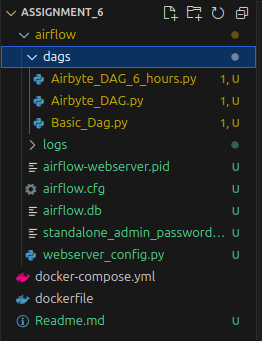

# Basic DAGs for Running Sync 

I have provided a set of very basic DAGs.

## Steps to Start the Project 

1. Build the Docker image.  
2. Compose the `docker-compose` file.  
3. Place the `dags` folder into the newly created Airflow directory.  

### Notes:
- DAGs will take **2 - 5 minutes** to load in the Airflow UI.  
- Port mapping is set to `8080:8080`, so you can access Airflow at **[localhost:8080](http://localhost:8080)**.  
- Username: `admin`  
- Password: Available in the `standalone_admin_password.txt` file inside the Airflow directory.  

### Folder Structure  
After completing all the steps, your folder structure should look like this:  



---

## For Airbyte  

- Use a **virtual environment** with Python **3.11.11** (works perfectly with Airbyte).  
- Install Airbyte using:  

  ```bash
  pip install airbyte
### Checking Airbyte Connectors  

To verify that Airbyte is working, you can run the following Python script:  

```python
import airbyte as ab
results = ab.get_available_connectors()
print(results)
